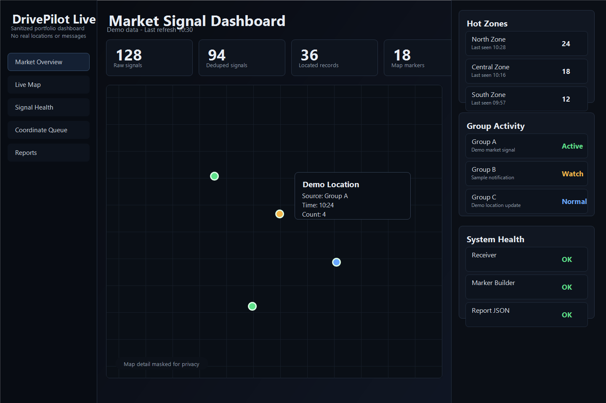
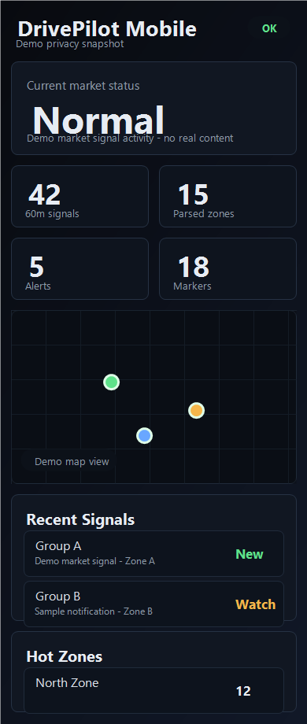
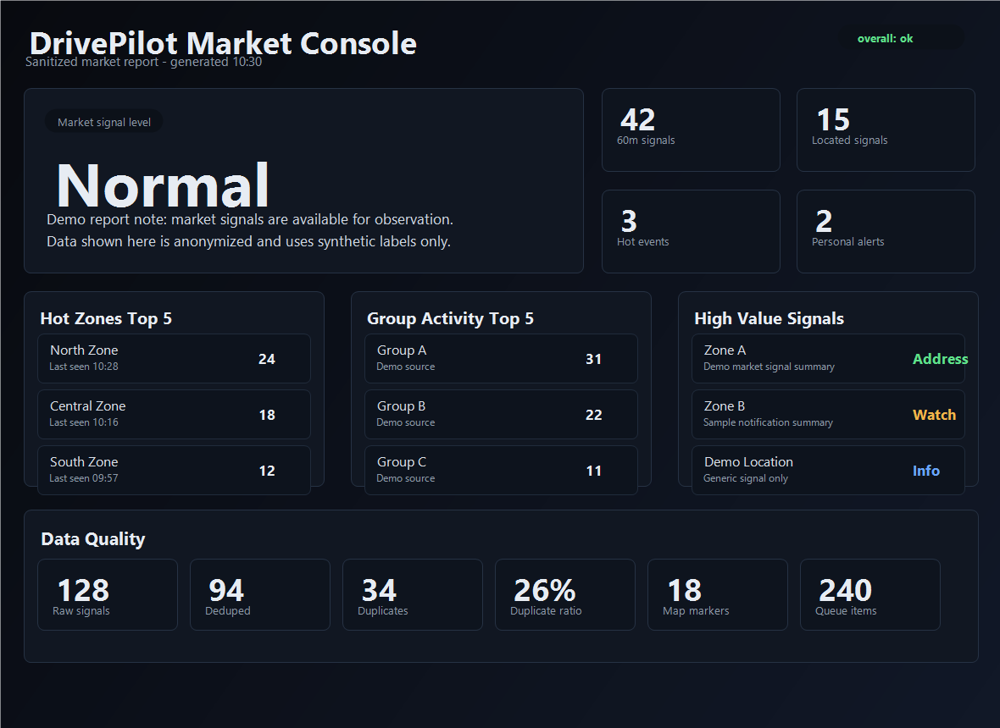

# DrivePilot Live

DrivePilot Live is a local-first market-signal observation system for LINE
ride-driving work-group notifications. It turns noisy mobile notification
streams into a structured command-center view for market rhythm, group activity,
location distribution, system health, and report snapshots.

This project is a public, resume-friendly version of the original workspace. It
demonstrates the product thinking, data pipeline, frontend interfaces, and local
automation behind DrivePilot while excluding private runtime data and
credentials.

DrivePilot Live is not an auto-order tool. It does not operate LINE, accept
jobs, make dispatch decisions, predict income, or automate user actions.

## Overview

DrivePilot Live was built to help a driver understand market activity from
multiple LINE work groups without manually scanning every notification. The
system receives forwarded Android notifications, parses market-relevant signals,
organizes location and group activity data, and presents the results through
desktop, mobile, live map, and Market Console views.

The project focuses on local-first reliability: the operator can inspect each
generated data artifact, run maintenance scripts manually, and verify the system
state without relying on a hosted backend.

## Problem

LINE ride-driving work groups can generate a high volume of fast-moving
notifications. Useful market signals are mixed with repeated posts, unclear
addresses, group chatter, and time-sensitive updates.

The core problems were:

- Important market signals were easy to miss in noisy notification streams.
- Address text extraction and coordinate readiness needed to be treated as
  separate states.
- Map markers needed an auditable source instead of directly trusting raw parser output.
- Mobile viewing needed to be lightweight and quick while driving.
- The system needed observability around parser output, marker health, queue
  status, and data freshness.
- Private messages, addresses, and credentials needed to stay local.

## Solution

DrivePilot Live converts notification streams into structured local data and
dashboard views:

1. MacroDroid forwards selected Android notifications to a local receiver.
2. The receiver stores notification records in a local file-based data layer.
3. Parser and resolver scripts extract signal metadata, address candidates,
   confidence hints, and location status.
4. Missing-coordinate and marker-builder workflows separate unresolved
   candidates from confirmed marker output.
5. Market report builders summarize recent signal volume, group activity,
   marker health, and queue status.
6. Frontend views display the information through a desktop dashboard, mobile
   dashboard, live map, and Market Console.

The result is an observation tool for market awareness, not a dispatch or
automation system.

## Core Features

- Local HTTP notification receiver for Android notification forwarding.
- Parser pipeline for market signals, address-like text, source/group metadata,
  and confidence classification.
- Clear separation between parser confidence and actual map-coordinate readiness.
- Missing Coordinate Queue for unresolved address candidates.
- MAP8 review/import workflow with explicit cache and review boundaries.
- Marker Builder that produces the formal map marker output from resolved data.
- Marker Health reporting for marker counts, invalid coordinates, missing
  addresses, and build timestamps.
- 24-hour signal statistics with short-window deduplication.
- Market Report JSON builder for deterministic report snapshots.
- Desktop dashboard, mobile dashboard, live map, and standalone Market Console pages.
- Windows-friendly BAT and PowerShell entrypoints for local operation.

## Technical Architecture

```text
LINE work-group notifications
-> MacroDroid Android notification capture
-> Local HTTP POST receiver
-> DrivePilot parser / resolver scripts
-> Local file-based data layer
-> Queue, marker, health, and report builders
-> Dashboard / Mobile Dashboard / Live Map / Market Console
-> Optional Discord notification path
```

Key architectural decisions:

- Local-first data flow using generated JSON and CSV artifacts.
- Explicit builder scripts instead of hidden background database mutations.
- Separate outputs for unresolved candidates, reviewed coordinates, formal map
  markers, marker health, and market reports.
- Frontend pages read generated artifacts with cache busting.
- Public copy excludes private runtime data and credentials.

## Technology Used

- Python for parsing support scripts, statistics builders, coordinate queue
  generation, marker output, and market report generation.
- PowerShell for the local receiver, local server workflow, status checks, and
  Windows automation.
- BAT files for operator-friendly manual entrypoints.
- HTML, CSS, and vanilla JavaScript for the dashboard and Market Console interfaces.
- Leaflet for map visualization.
- JSON, JSONL, and CSV artifacts for a transparent local data layer.
- Git for the sanitized public portfolio version.
- `live-system/README.md` explains the runtime scripts.
- `docs/demo-data/` contains sanitized sample outputs.

## What This Project Demonstrates

- Building a real-world local operations console from messy notification data.
- Designing a safety boundary between observation, alerting, and automation.
- Creating auditable data pipelines with intermediate artifacts.
- Separating parser confidence, coordinate resolution, marker readiness, and UI
  display states.
- Implementing lightweight frontend dashboards without a large framework.
- Designing recovery and health-check workflows for a local Windows-based system.
- Preparing a privacy-safe public version of a project that originally handled
  sensitive runtime data.

## Project Outcomes

- End-to-end local pipeline from mobile notifications to market dashboard views.
- Dedicated Market Console for data-driven market report review.
- Formal marker-output pipeline with marker health metrics.
- Missing-coordinate queue and review workflows for controlled coordinate completion.
- 24-hour statistics with deduped signal counts and duplicate visibility.
- Clearer UI semantics around parsed address confidence versus actual location
  readiness.
- Sanitized public repository suitable for portfolio review.

## Safety and Privacy

This repository is a sanitized public copy. It intentionally does not include:

- Real LINE raw messages.
- Live operational data.
- `live-data/` runtime files.
- `config/` private configuration.
- API keys.
- Webhook URLs.
- Private address caches.
- Phone numbers or personal data.
- Local logs or JSONL diagnostic records.

DrivePilot Live does not:

- Operate LINE.
- Auto-accept orders.
- Make dispatch decisions.
- Predict income.
- Provide driver scoring.
- Bypass platform rules.

## Screenshots

### Desktop Dashboard



### Mobile Dashboard



### Market Report



## My Role

I designed and implemented the DrivePilot Live workflow end to end:

- Defined the local-first product scope and safety boundaries.
- Built the notification ingestion and local server workflow.
- Implemented parser/resolver support scripts and data builders.
- Designed the missing-coordinate, marker-builder, marker-health, and
  market-report pipeline.
- Built the desktop, mobile, live map, and Market Console frontend views.
- Added Windows-friendly operational scripts for manual refresh, status checks,
  and local routines.
- Sanitized the project into a public GitHub-ready portfolio version without
  exposing private runtime data.

## Project Documentation

- [Project Case Study](docs/project-docs/drivepilot-project-case-study.pdf)  
  A public resume-oriented project summary covering product context, system
  architecture, implementation highlights, privacy handling, AI-assisted
  development workflow, and roadmap.
